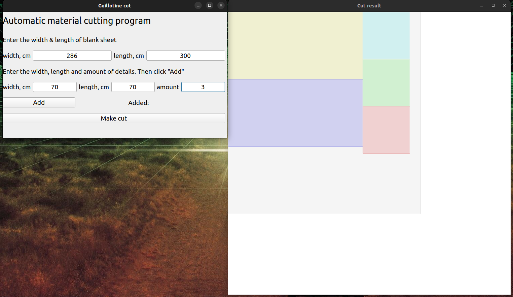
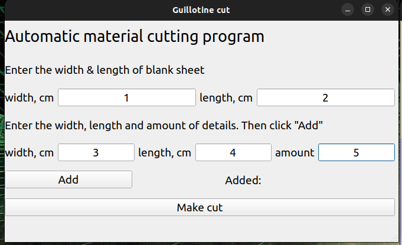

# Qt5 Guillotine cut programm.

Application for automatic cutting of rectangular details.


## How to use
* Enter width, cm (1) and length, cm (2) of blank sheet.
* Enter width, cm (3) and length, cm (4) of new detail.
* Click: "Add". 
* Repeat the previous two steps to add another detail. 
* When all the necessary details have been added click: "Make cut".

## Under the hood
```
Before adding a new detail, the list with the leftovers is checked:
	No suitable leftover: cut from main sheet

           ← length →
        -----+----+------+   ↑
             |    |      |
             | 2  |   1  |  width
             |    |      |
        _____|____|______|   ↓
        
	Exist suitable leftover:
		First leftover enought:

             ← length →
          ---------+-------+   ↑
                   |   1   |
                   +-------+  width
                     |  2  |
          ___________|_____|   ↓
          
          First + next leftover enought:

             ← length →
          -----+----+------+   ↑
               |  2 |   1  |
               +--+-+------+  width
                  |    3   |
          ________|________|   ↓
          
          First + next leftover - is not enought, an additional cut
          from the main sheet

               ← length →
            -----+----+------+   ↑
                 |  2 |   1  |
              +--+----+------+  width
              |       3      |
            __|______________|   ↓
```
  
## Project goal

Assignment for probationers.

## Requirements 
* Qt5 with:
* QPalette, 
* QBrush, 
* QPainter, 
* QRubberBand, 
* QWidget

## Docs
[Docs](Docs/)
